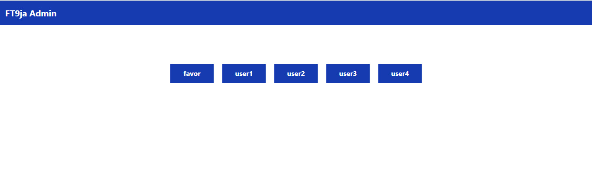

#### This project is built with django, bootstrap, javascript and chartjs. It has a registration and login page for users. 
#### It then has a dashboard for each user that generates a chart every 60 seconds according to the task directives, showing Profit or loss or the y-axis and time in seconds on the x-axis. The y-axis is generated randomly. The Profit or loss is determined by the 100 treshold amount. Data points lower that 100 means there was loss while those above 100 means profit was made.

#### The Challenge I faced while working on this project was my inability to quickly setup mongodb, so I decided to use SQLITE so as to complete the project on or before submittion time. 

#### To locate the admin page, use this link : http://127.0.0.1:8000/adminpage/

## To install:

#### clone repo
#### cd into the project root folder
#### type "pip install -r requirements.txt" on the command line.
#### and then, use "python manage.py runserver" to run.

### See below some screen shots.

#### Created by Victor Omuya 